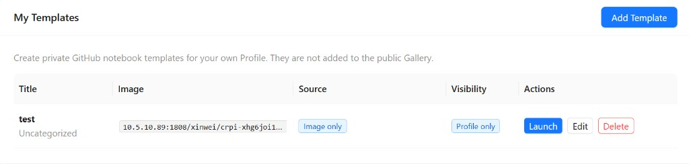

In **My Templates**, click **Launch** on the row of the template you want to run.

Allocation takes a moment while the platform finds a node, pulls the image, and attaches storage. The dialog reports progress and reads **Your workspace is ready (100%)** when the instance is up.

## What you get back

Once the instance is ready, the dialog shows the ways into it. Which of these appear depends on the template:

- **Open Notebook** — opens [JupyterLab](/radeon-cloud-docs/guides/jupyterlab/) in a new tab.
- **SSH access** — a copy-ready command plus host, port, and username, if the template had [SSH enabled](/radeon-cloud-docs/guides/ssh/).
- **Base URL, Model, API Key** — for vLLM and SGLang templates, the [dedicated model endpoint](/radeon-cloud-docs/guides/model-apis/#dedicated-endpoints).

The same information stays available under **Active Instance** in your Profile, so you can close the dialog safely.

## Limits worth knowing

**One instance at a time.** Each account can have a single active instance. Destroy the current one before launching another.

**Credits are checked up front.** You need at least as many credits as GPUs you're requesting. See [Credits](/radeon-cloud-docs/guides/credits/).

**GPU count is 1, 2, or 4.** Other values are rejected.

**Launches are rate limited.** Repeated launches in quick succession are throttled — roughly one per minute, three per ten minutes, five per hour. If you hit the limit, the console tells you how long to wait.

## If a launch fails

An instance can fail to start if the image is large and slow to pull, if the cluster is momentarily out of capacity for the GPU count you asked for, or if the template's start command exits immediately. Check the status message in the dialog, then see [Troubleshooting](/radeon-cloud-docs/resources/troubleshooting/).
