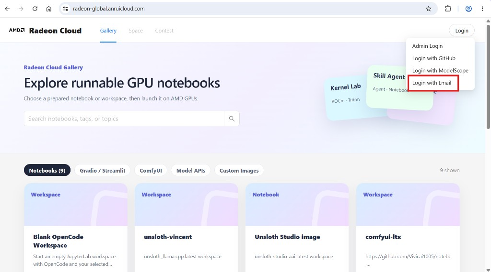

Open [radeon-global.anruicloud.com](https://radeon-global.anruicloud.com/), click **Login** in the top-right corner, and choose **Login with Email**.

Enter your email address and the verification code sent to it. Codes are six digits and expire after a few minutes; if one doesn't arrive, wait for the cooldown to pass and request another.

Once you're signed in, click your avatar in the top-right corner and choose **Profile**. This page is where you manage everything: templates, the running instance, your SSH key, your API key, and your credit balance.

## If your account needs review

Some accounts are held for verification before they can launch instances. If you see a notice to that effect, you can still browse the console and use the [free shared model APIs](/radeon-cloud-docs/guides/model-apis/) — launching a GPU instance unlocks once the review completes.
