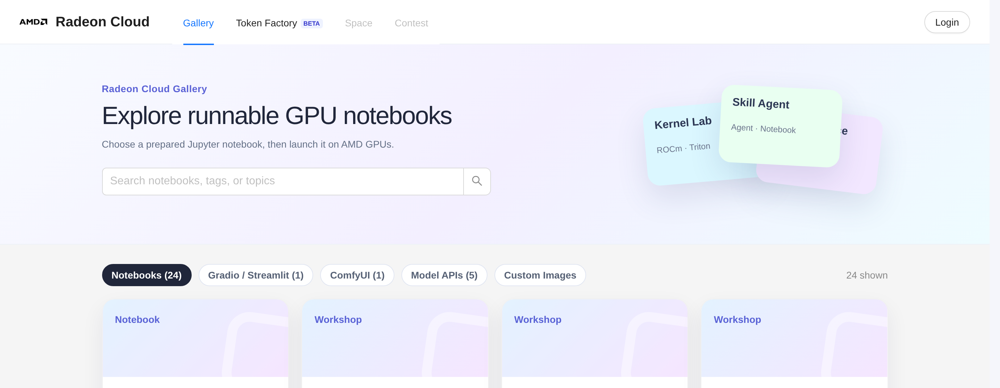
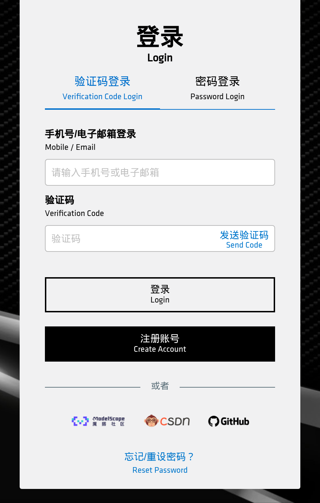

The two [regional sites](/radeon-cloud-docs/introduction/#two-sites-one-platform) sign you in differently. Pick the one for your region — accounts don't carry across.

## China site

Open [developer.amd.com.cn/radeon](https://developer.amd.com.cn/radeon/) and click **Login** in the top-right corner.

This takes you to the AMD AI Developer Program sign-in, which is shared across AMD's China developer services — the same account works for the [points program](https://developer.amd.com.cn/points/redeem) that funds your [credits](/radeon-cloud-docs/guides/credits/).

You have several ways in:

- **Verification code** — enter a mobile number or email address, click **Send Code**, then enter the code you receive.
- **Password** — switch to the **Password Login** tab if you've already set one.
- **ModelScope, CSDN, or GitHub** — sign in with an existing account from one of these.

No account yet? Click **Create Account**.

## Global site

Open [radeon-global.anruicloud.com](https://radeon-global.anruicloud.com/), click **Login** in the top-right corner, and choose **Login with Email**.

Enter your email address and the six-digit code sent to it. Codes expire after a few minutes; if one doesn't arrive, wait for the cooldown and request another.

## After signing in

Click your avatar in the top-right corner and choose **Profile**. This page is where you manage everything: templates, the running instance, your SSH key, your API key, and your credit balance.

## If your account needs review

Some accounts are held for verification before they can launch instances. If you see a notice to that effect, you can still browse the console and use the [free shared model APIs](/radeon-cloud-docs/guides/model-apis/) — launching a GPU instance unlocks once the review completes.
