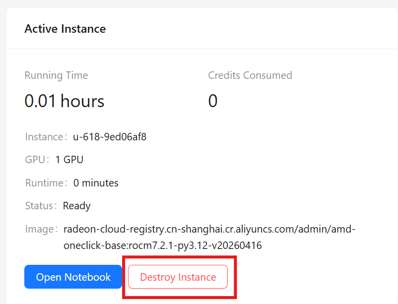

实例只要在跑就一直扣额度，不管你用不用。用完就销毁它。

去 Profile 里的 **Active Instance**，点 **Destroy Instance**。



:::caution[先检查你的文件]
除非模板用了 **Persistent (PVC)** 存储，否则实例里的一切会随它一起删掉。销毁之前先把需要的东西下载走，或者推到仓库里。
:::

实例很快就没了，额度停止消耗，你可以启动新的了 —— 记住每个账号同时只能有一个活跃实例。

## 实例也会自己停

实例有最长生存时间和空闲超时，两者都按实例类型配置。碰到任何一个，实例都会被自动关掉。把这当成兜底手段而不是计划：一个跑到一半撞上生存上限的实例，活儿白干了，之前花掉的额度也回不来。

## 用脚本销毁

```bash
curl -X DELETE https://radeon-global.anruicloud.com/api/notebook/current \
  -H "Cookie: <session>"
```

完整 API 见[实例](/radeon-cloud-docs/zh-cn/api/instances/)。
