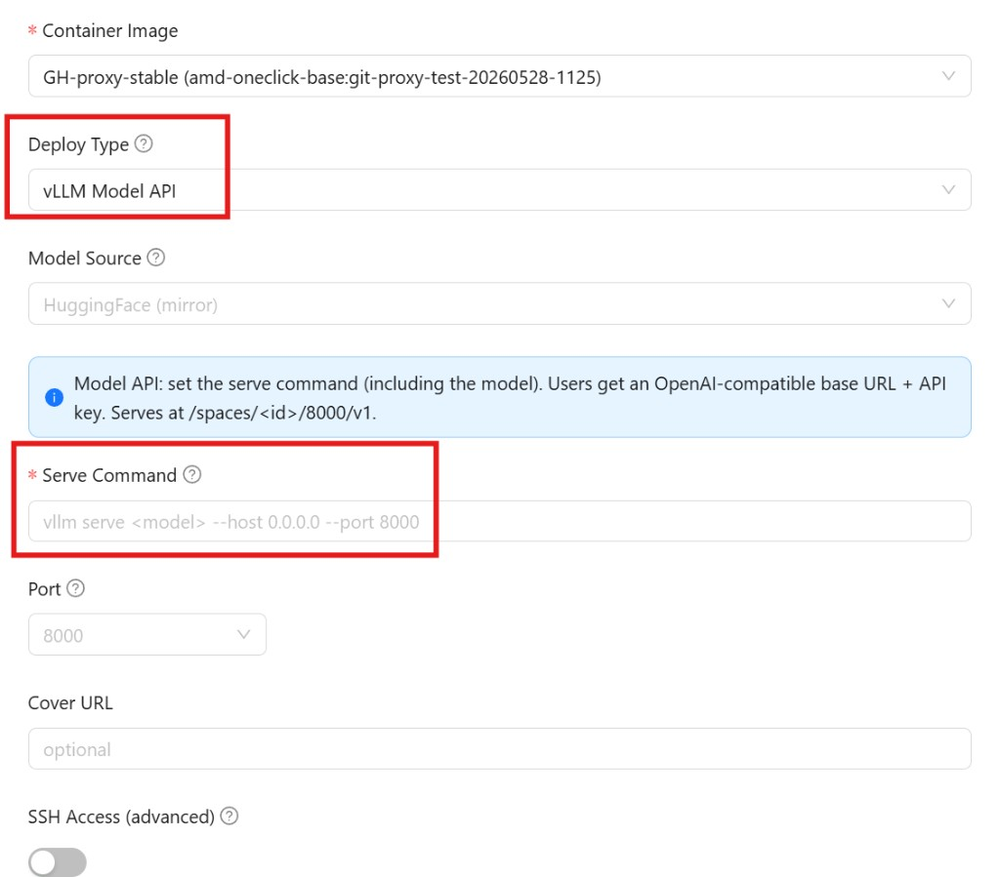

AMD Radeon Cloud 通过兼容 OpenAI 的 HTTP API 提供模型服务。任何能连 OpenAI 的客户端，改一下 base URL 和 key 就能用：`curl`、`openai` SDK、LangChain、Cherry Studio。

两个选择，区别在于 GPU 是谁的。

## 免费共享端点

共享端点常驻在线，不花钱。不用启动实例，也不消耗额度。有哪些模型可用由平台决定。

打开 [Token Factory](https://developer.amd.com.cn/radeon/modelapis) 并登录。


在 **Public Free Model APIs** 下挑一个模型。详情弹窗里有 base URL、模型名、你的 API key，还有一条可以直接跑的 curl 命令。


```bash
curl https://developer.amd.com.cn/radeon/api/v1/chat/completions \
  -H "Authorization: Bearer $RADEON_API_KEY" \
  -H "Content-Type: application/json" \
  -d '{"model":"DeepSeek-V4-Flash","messages":[{"role":"user","content":"Hello"}]}'
```

一个 key 通用于所有共享模型。想换模型，改 `model` 字段就行。

共享端点支持 **chat completions** 和**列出模型**。请求按 key 和按 IP 限流，另有每日消耗上限 —— 见[频率限制](/radeon-cloud-docs/zh-cn/api/rate-limits/)。

## 专属端点

专属端点把模型跑在你自己的实例上，模型和服务配置都由你定。实例运行期间会一直消耗额度。

1. 在[控制台](https://radeon-global.anruicloud.com/)里进 **Profile → Add Template**。
2. 把 **Deploy Type** 设成 **vLLM Model API**，然后写 serve 命令。



```bash
vllm serve Qwen/Qwen2.5-7B-Instruct --host 0.0.0.0 --port 8000
```

:::caution[务必保留 `--host 0.0.0.0 --port 8000`]
平台把公网端点路由到容器内的 8000 端口。服务如果绑到别处，端点就够不着它。
:::

3. 保存，然后 **Launch** 这个模板。实例就绪后，弹窗会给出形如 `https://<host>/spaces/<instance-id>/8000/v1` 的 **Base URL**，以及模型名和 API key。

用法和共享端点完全一样，只是换成这个 base URL：

```bash
curl https://<host>/spaces/<instance-id>/8000/v1/chat/completions \
  -H "Authorization: Bearer $RADEON_API_KEY" \
  -H "Content-Type: application/json" \
  -d '{"model":"Qwen/Qwen2.5-7B-Instruct","messages":[{"role":"user","content":"Hello"}]}'
```

因为请求是直接打到 vLLM 或 SGLang 上的，那个服务暴露什么，专属端点就暴露什么 —— 通常除了 chat 之外还有 completions 和 embeddings。

## 怎么选

先用共享端点。等到需要目录里没有的模型、想控制服务参数，或者需要不与他人共享的吞吐时，再换专属端点。

完整的请求和响应细节见 [API 参考](/radeon-cloud-docs/zh-cn/api/overview/)。
