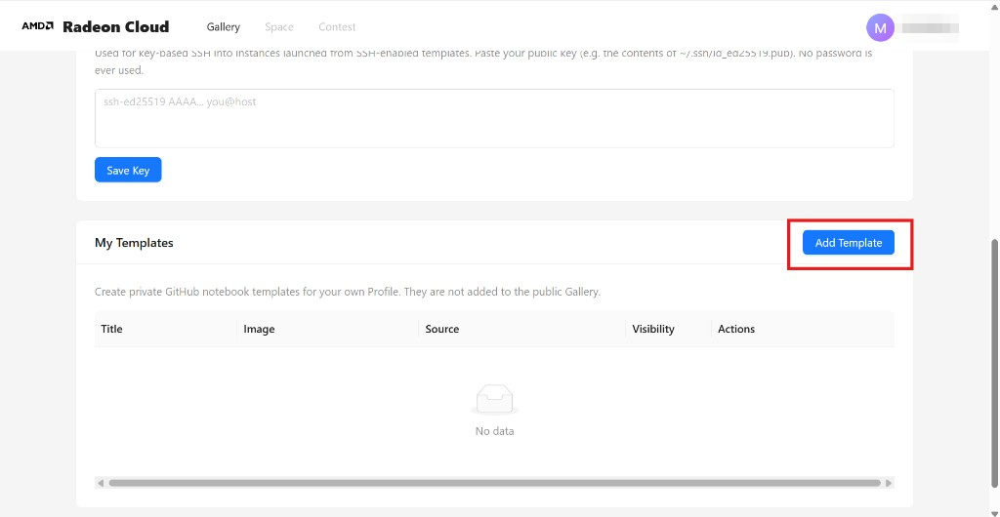
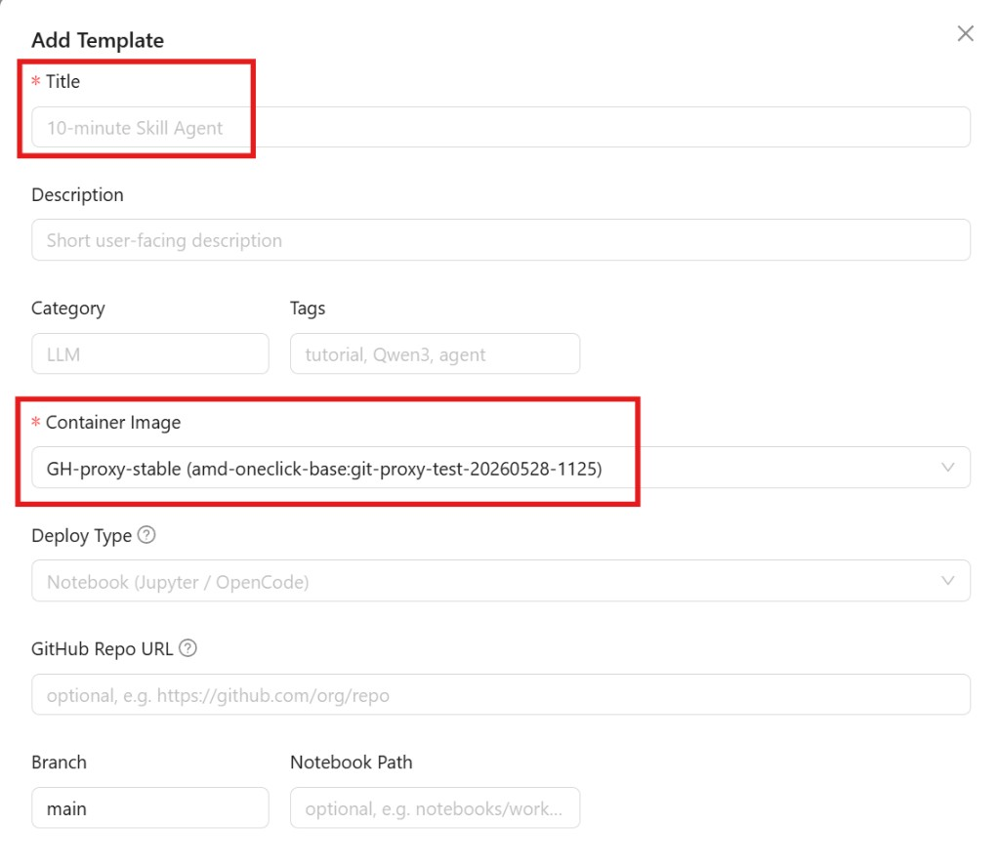

模板是实例的配方。它记录了要跑哪个容器镜像、分配多少 GPU 和磁盘，以及什么该自动启动。实例都是从模板启动的，所以把模板一次配好，就省下了每次重来的麻烦。

在 Profile 的 **My Templates** 区域，点 **Add Template**。

## 必填项

**Title** —— 模板的名字，方便你在列表里认出它。

**Container Image** —— 实例运行的基础镜像。从目录里挑一个；预装 ROCm 的 PyTorch 镜像通常是最合适的起点。

## 存储

想让文件留下来，就把 **Storage** 设成 **Persistent (PVC)**。用了持久化存储，写进工作区的数据在实例销毁后仍然保留，下次启动还在。不用的话，实例一没，东西全没。

磁盘容量从 100 GB 起步，上限随 GPU 数量增加 —— 1 块 GPU 是 100 GB，2 块是 150 GB，4 块是 200 GB。

## SSH 访问

想从自己的终端连进实例，保存之前要打开 **SSH Access (advanced)** 开关。只有从启用了 SSH 的模板启动的实例才能用 SSH 连 —— 事后加不上。见[通过 SSH 连接](/radeon-cloud-docs/zh-cn/guides/ssh/)。

## 部署模型而不是打开 notebook

如果你要把模型部署成兼容 OpenAI 的端点、而不是打开一个 notebook，把 **Deploy Type** 设成 **vLLM Model API** 或 **SGLang**，再填一条 serve 命令。见[模型 API](/radeon-cloud-docs/zh-cn/guides/model-apis/#专属端点)。

## 保存

点表单底部的 **Add Template**。模板会出现在 **My Templates** 里，随时可以启动。

除非你在平台上有编辑者权限，否则你创建的模板只有自己能看到。
